# Homework 3: L-systems
Houdini L-Systems Option
* Design a plant. Use at least 6 grammar rules (arbitrary number chosen for complexity)
* The plant should have flowers, fruits, leaves or something that is not just branches
* The plant must be rendered nicely, no wireframe or naked gray lambert

# Leo's Christmas Tree
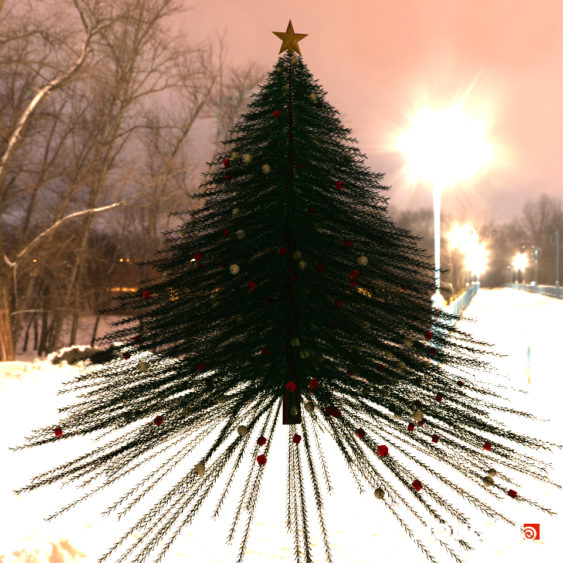   
    

[Houdini file](https://github.com/LEO-CGGT/hw03-l-systems/blob/master/mychristmas-tree7.hipnc)  

Rules:

```
g(0)F(0.6)AM
A=F(0.06 + rand(i)*0.01)DDDDDDDDDDDDA
B=g(1)!(0.4)^(rand(i) * 10 + 35)F^(rand(i) * 10 + 35)C  
C=F(0.04 + rand(i)*0.02)EEEOC 
D=/(rand(i) * 10 + 25)[^B]
E=g(2)/(rand(i) * 10 + 55)[+F]
I=J:0.00001
N=K:0.000005 
O=IN:0.2
```
# Features
* The tree mesh is completely generated by an L-system node using 8 rules.
* The decors are geometries node but they are added to the tree according to the rules of the L-system node
* Each part of the Christmas tree (stump, leaves, branches, decors) has its own material, and the final scene is using enviromental lighting and rendered by Mantra. 
# Design Write-up
## Step 1 - Breaking down the components of a Christmas tree
The first step is break down what are the components that form a Christmas tree.    
Just like most other trees, it has a stump, branches, and leaves. There are also decoractions on the tree.    
We divide it into different components and conquer them seperately. 
## Step 2 - Generating leaves
The leaves of the Christmas tree is a trident-look shape. So, by having three turtle branches, and rotate each of them by 60 degrees, we are able to generate this shape. By recurring itself at the end, we have the rules for the leaves.    
`FA`, `A=F/(60)[+F]/(60)[+F]/(60)[+F]A`   
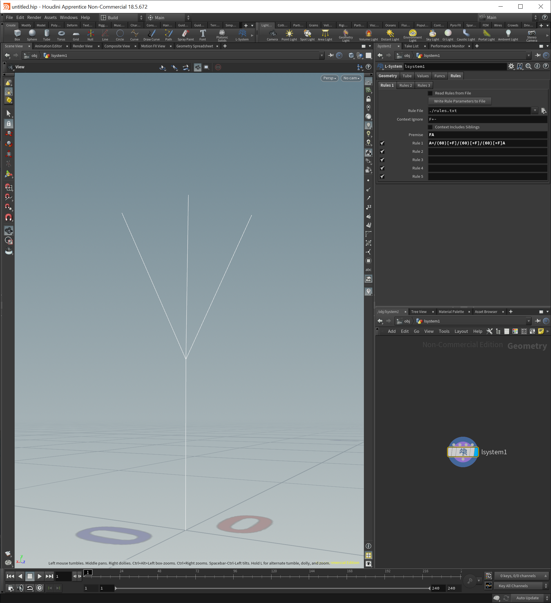   
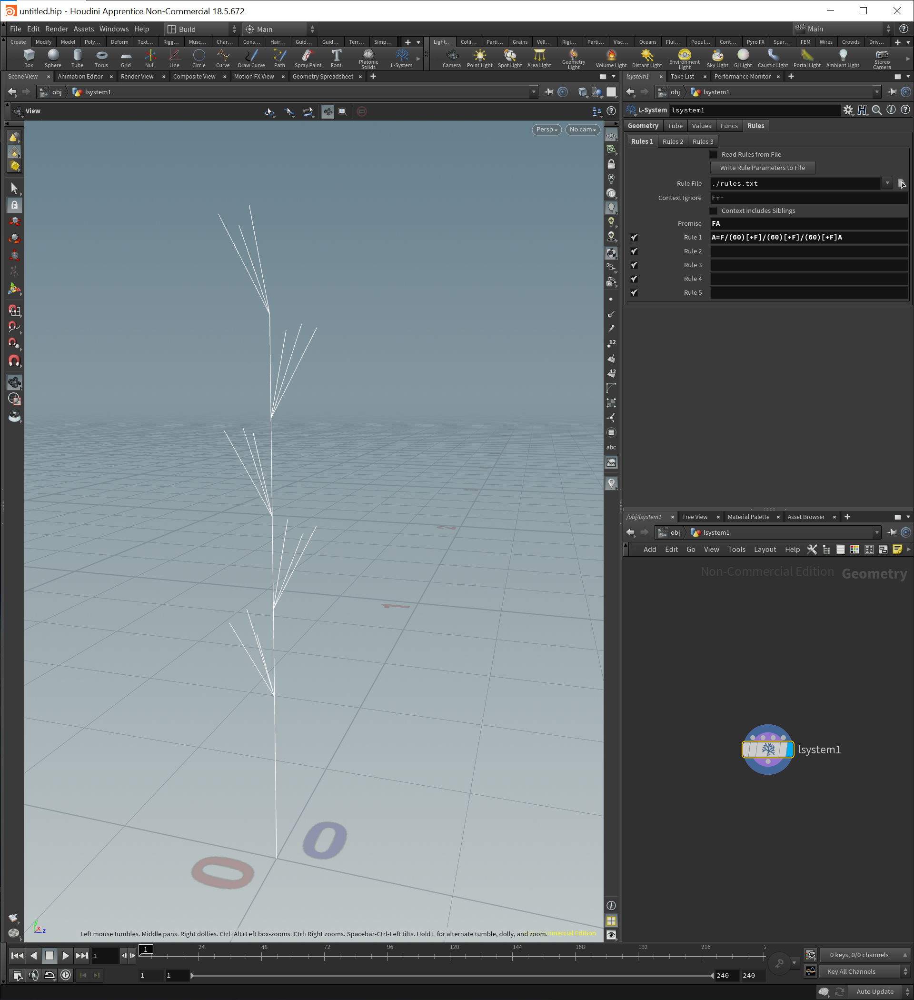   
## Step 3 - Generating the stump and branches
The stump is generally easy to generate. At each iteration, we simply keeps moving forward, that will generate a straight line as the stump.   
At the same time, we want each segment of the stump to have a circle of branches. This can be achieved by having n turtle branches, and each rotate 360/n degrees.   
By combining both ideas above, we have a stump and branches.   
`FA`, `A=F[^B]/(60)[^B]/(60)[^B]/(60)[^B]/(60)[^B]/(60)[^B]/(60)A`, `B=F`   
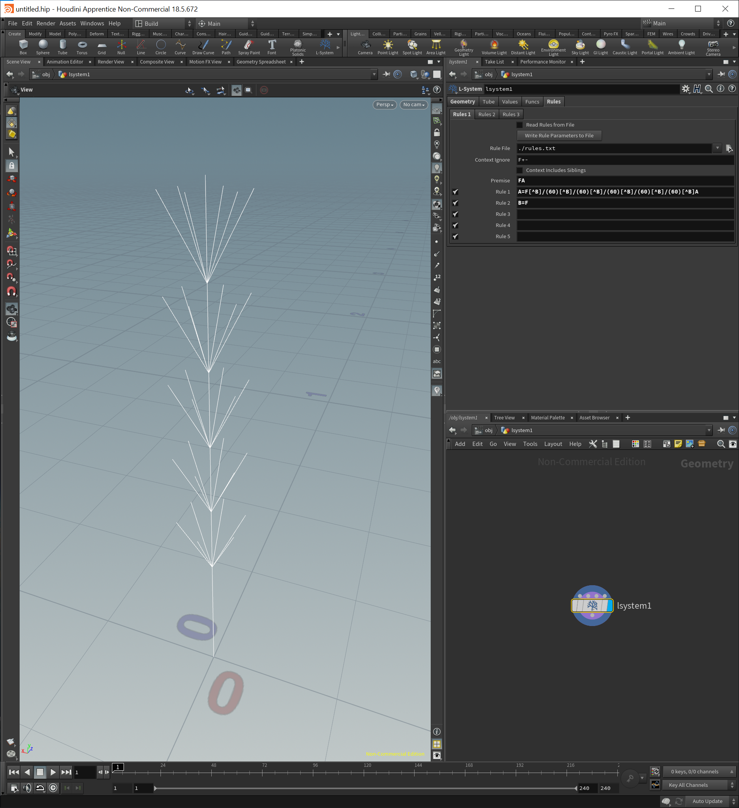    
## Step 4 - Combining leaves, branches, and the stump
By combining the above rules, we have a tree!    
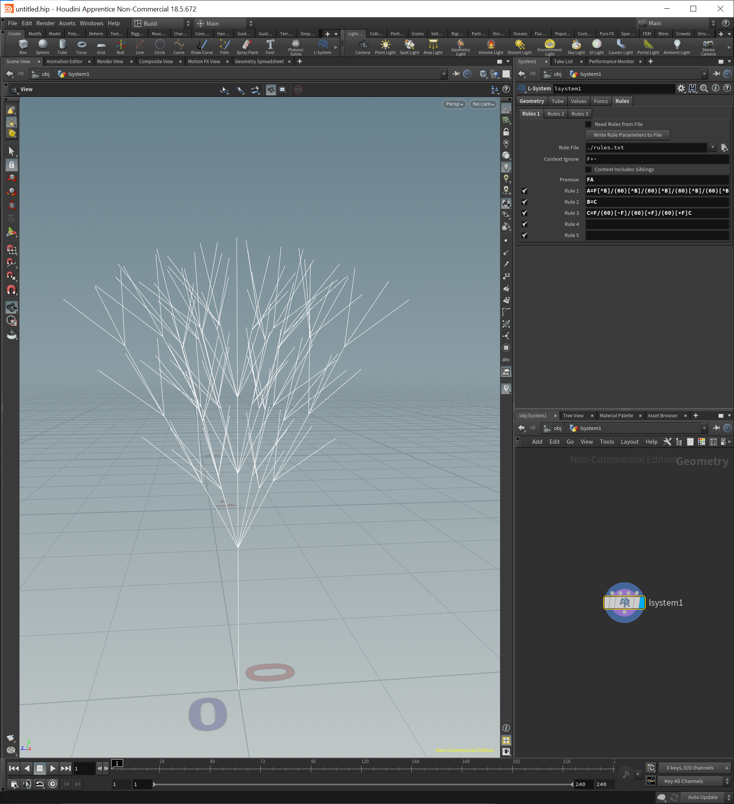    
However, comparing the result with an actual Christmas tree, we notice that the branches should be facing downwards instead of upwards.   
By chaging the rotation degrees of the branches, we have a better result:   
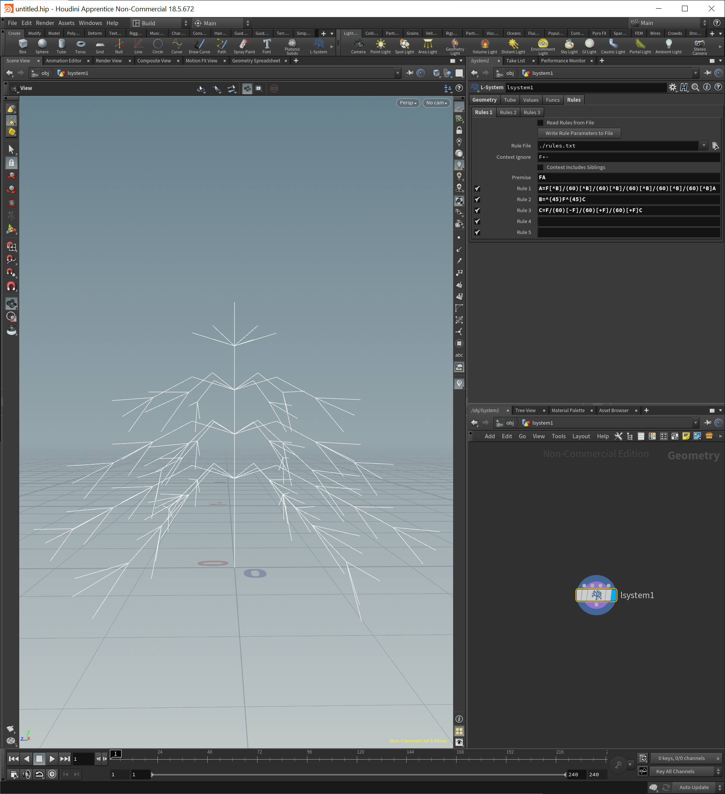    
## Step 5 - Tuning attributes and adding randomness
Now, we can slightly change the rotation degrees, adding the number of branches, and increase the number of iterations. The result starts to look like a real Christmas tree!   
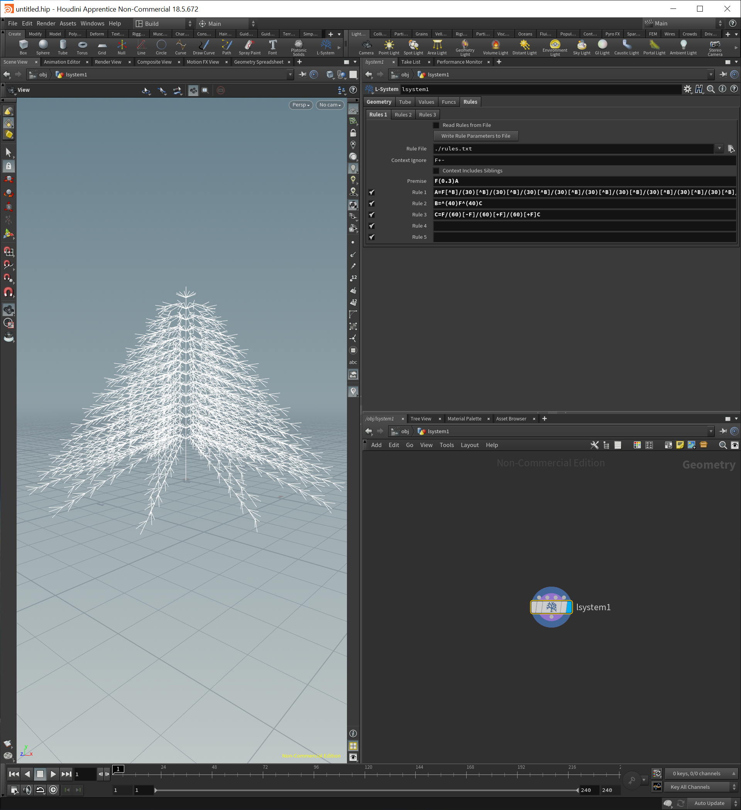    
The problem with the tree right now is that it looks too uniform. We can fix it by adding randomness to the rotation degrees. Instead of always rotating a fixed degree, now we give each branch and leave the freedom to rotate in a range. The result looks much more natural.   
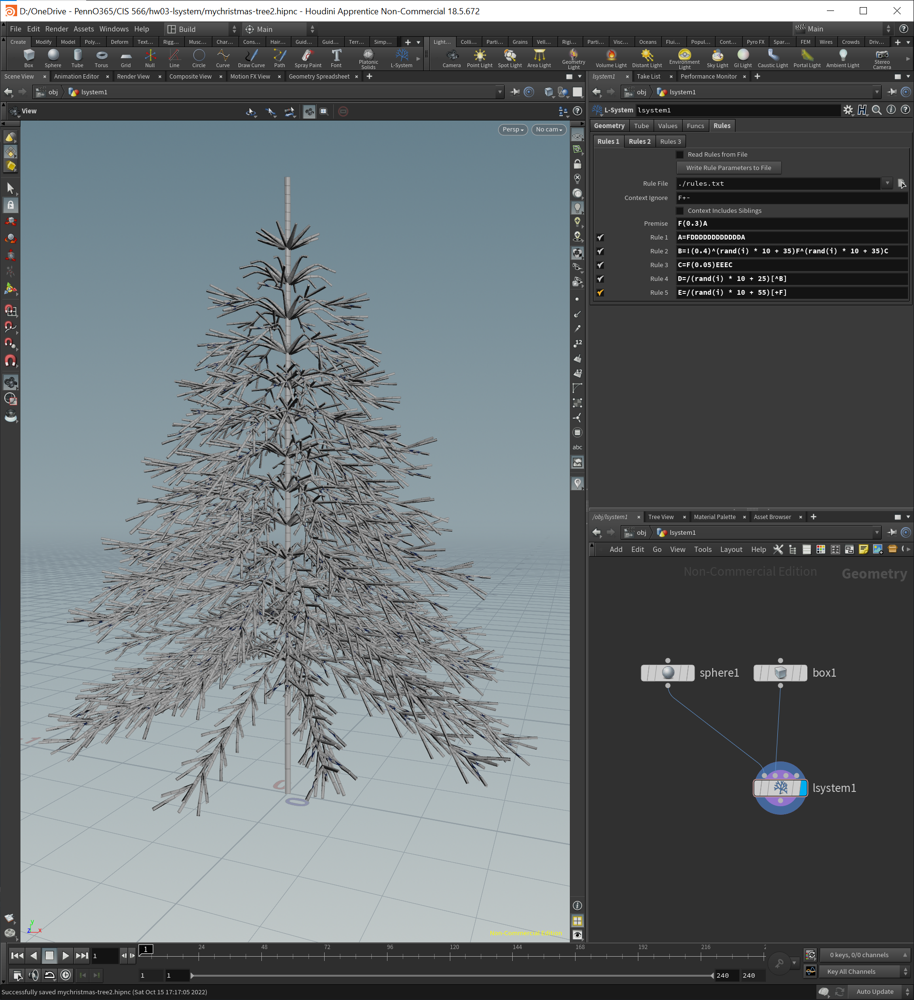    
## Step 6 - Adding decorations and colors
The next step is to add decorations and colors to the tree. Adding decorations is simple, we can create a box and a sphere primitive, connect them as the input to the L-system, and then use a rule to add them randomly. There is usually a star at the top of the Christmas tree. To add it, I found a mesh online ([source](https://sketchfab.com/3d-models/christmas-star-b3b13e26164948c69910119558616485)), and imported it to Houdini. By adding it at the end of the rule that generate the stump, it is added to the top of the tree once.       
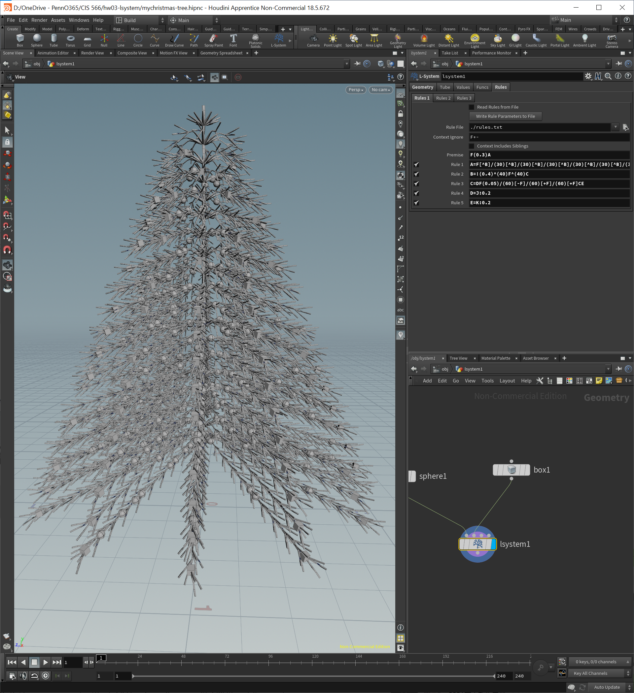     
Adding colors is a little more complicated, since each part of the tree has different colors. Luckily, Houdini allows us to group parts generated by differnt rules. With the L-system groups, we can then use the `Split` node to divide them and shade them seperately. By creating materials for the decors, leaves, branches, and the stump, I'm finally able to shade the tree correctly.    
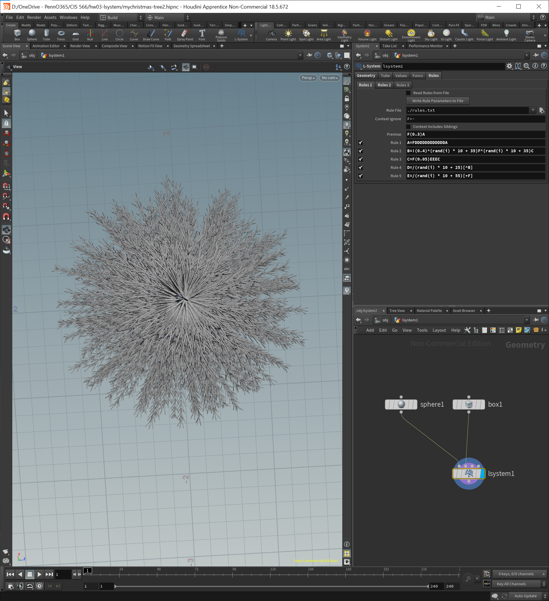    
## Step 7 - Adjust the stump thickness
Comparing it with a real Christmas tree, the only problem now is the thickness of the stump. Instead of being thick on the bottom and thin on the top, it is  is uniform. To achieve this effect, I wrote a simple script that applies a scale to the stump according to its y value:   
```
vector max = getbbox_max(0);
float scale = 3 * (max[1] - @P.y);
@P.x *= scale;
@P.z *= scale;
```
This scales down the thickness of the stump as it goes up.    
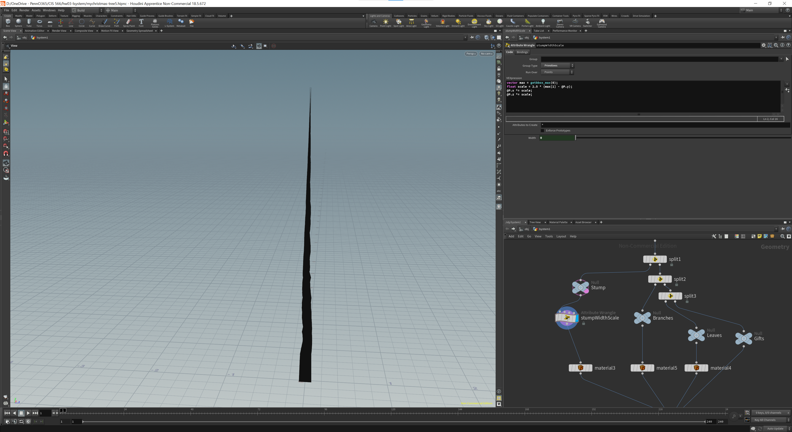    
## Step 8 - Setting up for rendering
With a complete Christmas tree and materials assigned to each part, the final step is to render it. To do so, I added a camera node to set a good-looking angle, added a EnviromentLight node and found a Winter-themed HDRI file ([source](https://polyhaven.com/a/night_bridge)).   
Now I'm ready to generate the final result.   
    
