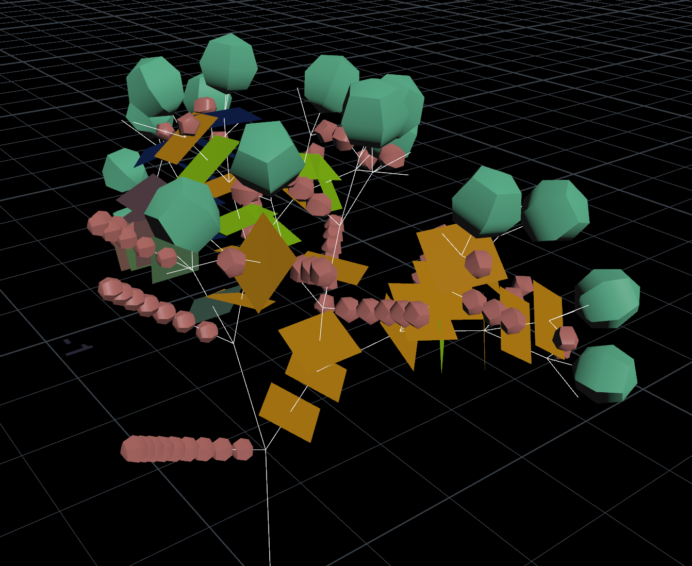
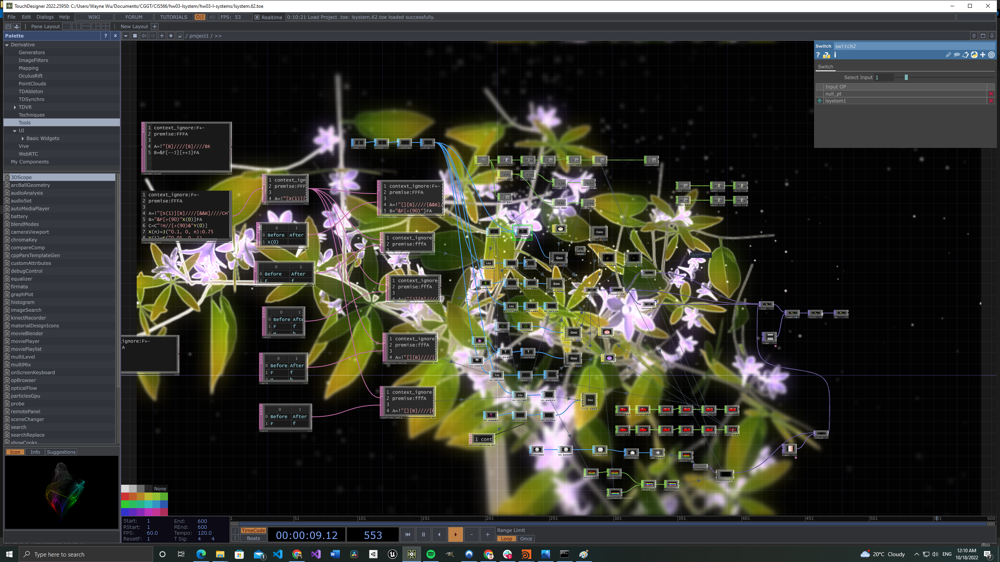

# Interactive L-systems in TouchDesigner


This project implements interactive L-systems in TouchDesigner.
The L-systems are controlled in real-time using LeapMotion. 
Currently, the control is very simple. As the user raises their hand, the plants will grow with it.
As they grab and hold their fist, the pink flowers will blossom.

[DEMO 1](https://vimeo.com/761320396)

## L-Systems

There are two L-Systems in this work: one for the base plants (including branches, leafs and small flowers), and another one for the pink/purple flowers that can blossom. Both L-Systems are relatively straightforward and were adopted from The Algorithmic Beauty of Plants.

The first L-System has the following rules:
```
premise:FFFA

A=!"[X(1)][B]////[&&B]////CH"Y(1)
B="&F[+(90)"X(0)]FA
C=C"!H//[+(90)&"Y(0)] 
X(n)=J("0.1, 0, n):0.75
Y(i)=K("0.05, 0, i)
```

The second L-System has the following rules:
```
premise:A(0)

A(n)=+(137.5)["f(n^0.5)C(n)]A(n+1)
C(n)=&(n*-180/b)J(0.5+(b-n)/b)
```

## Implementation

The main L-System was first prototyped in Houdini with basic geometries.


It was then ported to TouchDesigner, which has an almost identical L-System syntax.
However, in order make it real-time and interactive, it cannot be implemented with a single L-system with multi-geometry stamping.
The stamping mechanism will render hard copies of the geometries making it too slow.
Instead, geometry instancing is used. The main L-System is broken into many L-Systems each responsible for scattering points for a single geometry. For example, if we want to render the leafs (i.e. X(0)) for the system, we can modify the main L-System rule to the following:
```
premise:fffA

A=!"[][B]////[&&B]////Ch"
B="&f[+(90)"X(0)]fA
C=C"!h//[+(90)&"] 
X(n)=J("0.1, 0, n):0.75
Y(i)=K("0.05, 0, i)
```
This will only generate the points for the leafs without creating the branches and other geometries. This process is repeated for all geometries.
This method is inspired by the following tutorial: https://www.youtube.com/watch?v=qCwExvLf8DQ 




## LookDev

In addition to the L-Systems, this project also added a few additional elements to enhance the visuals:

1. Bloom Effect
2. Edge Outlining
3. Luma Blur
4. Particles that interact with the blossomed flowers

## References
- [The Algorithmic Beauty of Plants](http://algorithmicbotany.org/papers/abop/abop-ch1.pdf)
- [Principles of L-Systems - Houdini Kitchen](https://www.houdinikitchen.net/wp-content/uploads/2019/12/L-systems.pdf)
- [L-Systems in TouchDesigner](https://www.youtube.com/watch?v=qCwExvLf8DQ)
