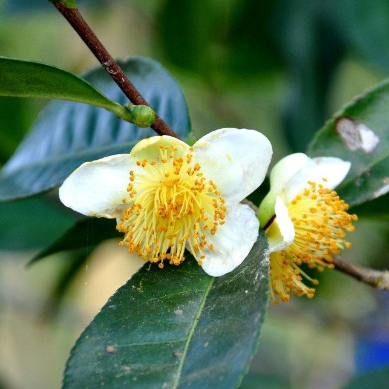
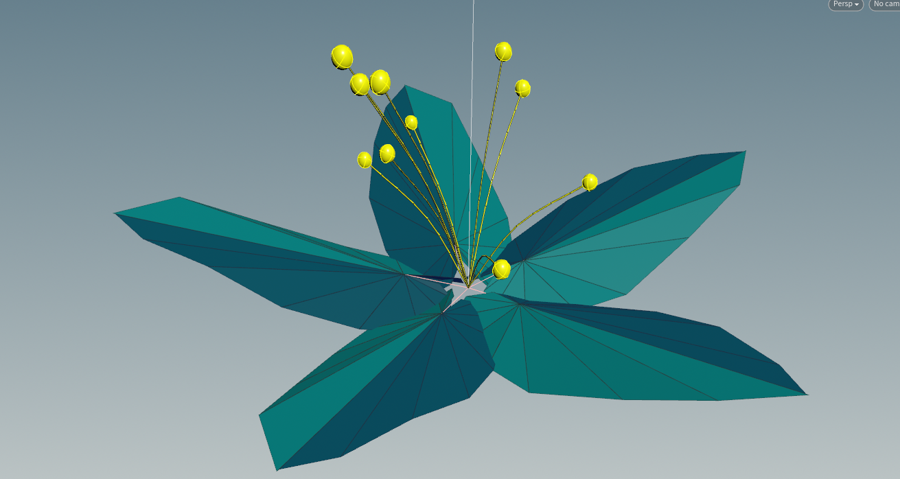
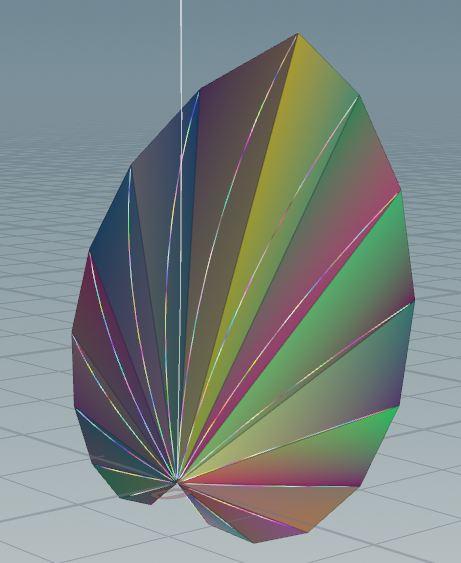
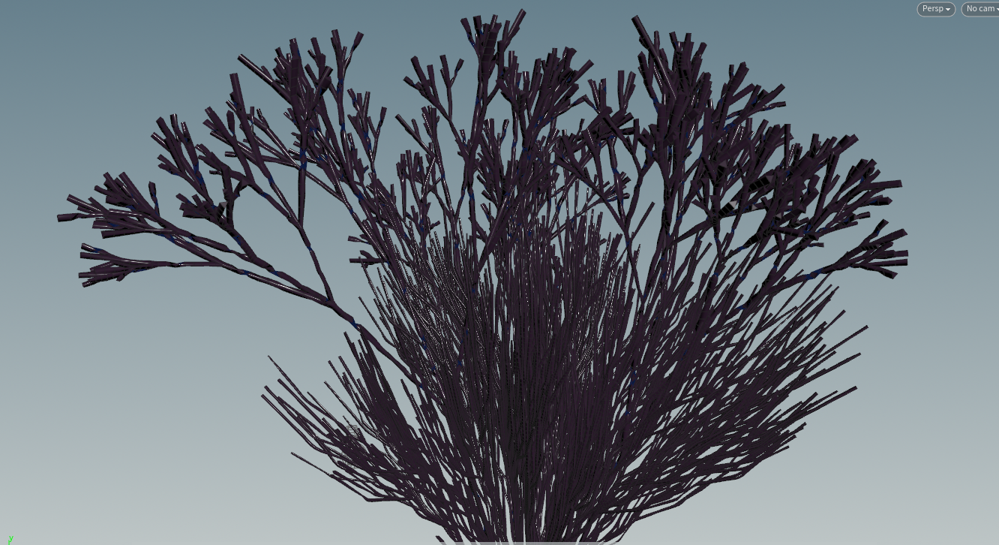
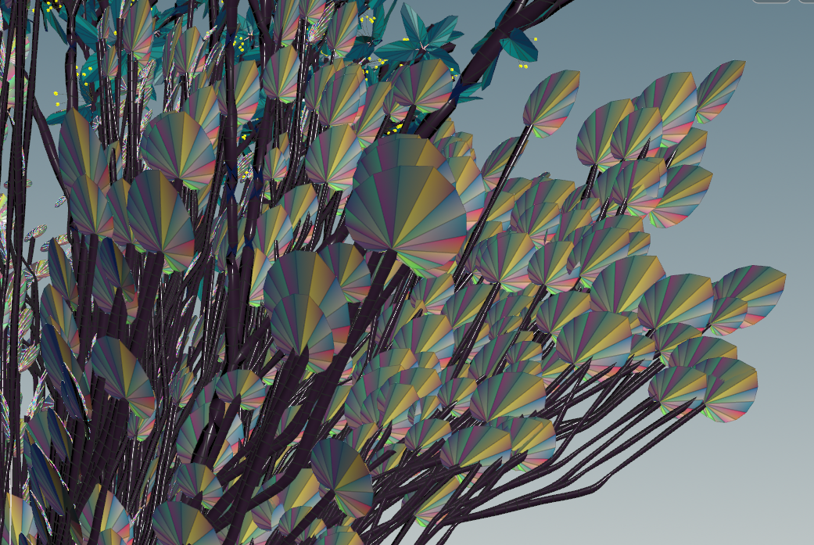
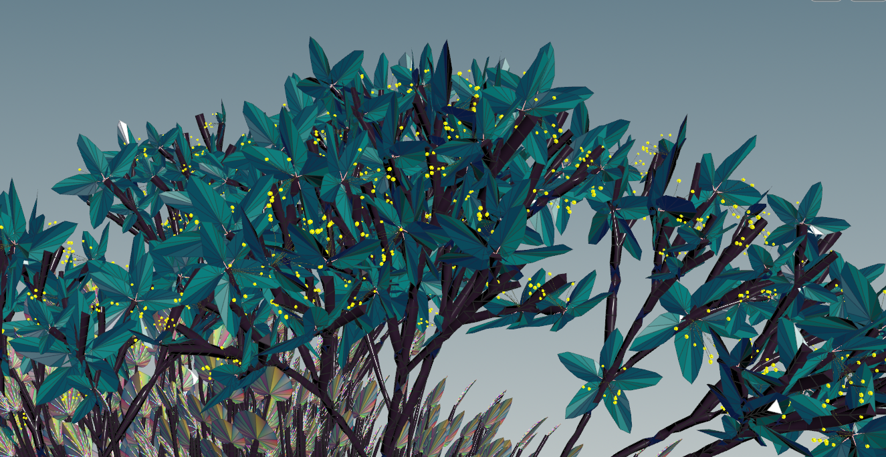
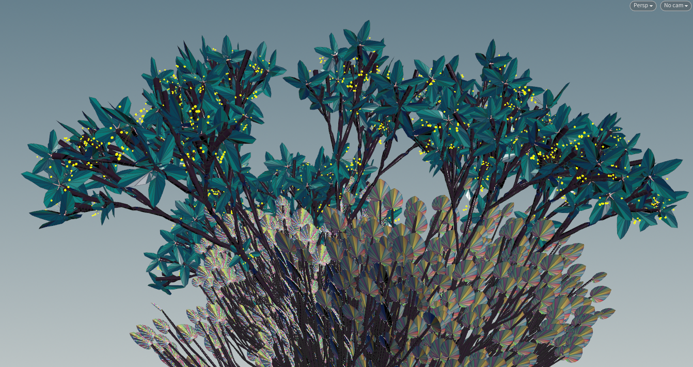

# Homework 4: L-systems
## (houdini option)

This project was mostly a lot of experimentation with many discoveries. Besides one lab in a prior week, this is the
first time I've used the houdini software. As such I'm figuring out the tree view, node conventions, controls etc all
over this one project.

In this case, like most artists, instead of thinking up something totally original, I thought of some existing works
to loosely start my ideas around. As a random curiosity, I looked up the 'camellia sinensis' (tea plant) as inspiration.
This plant looks mostly like a leafy bush, which I thought was relatively boring to start. However, I did like how it's
flowers looked. I decided that these should be mostly uniform throughout the plant. While it grew, instead of having
the flowers complicate, they should mainly grow in number. This lead me to look up how flowers were usually added to
L-systems after realizing it would not make sense to draw them using the rules of the base system.



Other examples on common tutorials indicated that usually flowers or other additions to L-systems were usually brought
in as geometry files created in some other program. Searching directly for these type of assets seemed a bit outside
of the spirit of the homework, so I set to making them with L-systems as well, which could be individually set / adjusted
and then fed to the main L-system as one of the JKL leaf nodes. (one side thing -- even in a sub system, I can see how
in some cases it might make sense to feed through the number of generations to the sub systems (bigger tree=bigger flowers),
however, I didn't note a straightforward way to accomplish this -- ask in future!)

For the flowers, I used some sphere primitives at the end of some 'antennae' looking stalks which were slightly 'curved'
using some randomness in the universal angle modifier thingy (~). I then used the built-in cordite leaf as a base for the petals,
modifying the rules slightly to add some convincing twist to them. The final flower was a system connecting the middle of the
flower with the petals

###Inner flower
```angular2html
Premise: X
Rule 1: X="[~(40)HTHTJ]/X
```

###Flower petal
```angular2html
Premise: [A][B]
Rule 1: A=[T~(5)+A{.].C.}
Rule 2: B=[T~(5)-B{.].C.}
Rule 3: C=FFFHC
```

###Outer system
```angular2html
Premise: BK
Rule 1: A=[^(90)&(10)HJ]
Rule 2: B=A/(72)B
```



For the leaf shapes, I again began with the built in cordite leaf sample. This time I made the leaves slightly curled by
bending along their axis.

###Rainbow leaves!
```angular2html
Premise: [A][B]
Rule 1: A=[+A{.].C.}
Rule 2: B=[-B{.].C.}
Rule 3: C=&(-2)F&(-2)FFC
```



The 'bush' itself was the most tricky. I wasn't satisfied with the rather boring, if skillful look, of the real life bush,
and this assignment was supposed to be creative, right? So I decided to make a more "alien tea" style plant. Weird, slightly
unnatural, eerie growing pattern to really fit the season, along with fun, wacky colors that would easily find a place
among the hanging gardens of _High Charity_. I went through a few iterations here to find something reasonable enough,
but still somewhat creepy. After starting from scratch and also a few of the presets, I was not super satisfied with any
of them, so I just went with combining a few rules to get a base bush, using the universal angle modifier thingy again
to generate some craziness, and then adding a custom 'second plant' which ran basically independent of the larger bush.
The plan was to have a slightly more ordered and slightly more chaotic system intertwined, with one encompassing the other,
and the leaves populating the lower system and flowers populating the upper. While I Was never completely satisfied with
the effect, I think it at least partially captures what I had in mind.

###Weird Alien tea plant outer system
```angular2html
Premise: AC
Rule 1: A=[&FLA]/////[&FLA]/////[&FLAJ]
Rule 2: F=S/////F(0.11)
Rule 3: S=FL
Rule 4: B=+(25)HHH-HH[B][/HHKB]B
Rule 5: C=[/(0)B][/(45)B][/(90)B][/(135)B][/(180)B][/(225)B][/(270)B][/(315)B]C
```



Finally there was wrangling with the colors. Besides some frusterations trying to figure out hoidini's point/line/primitive
system of color blending, this was fairly enjoyable. I went all out with the craziness. Flowers were bright blue as
alien flowers should be. The bark of the plant used a texture heavily tinted with purple. The leaves, of course, used
a random color palate. One of the coolest looking houdini features I've seen so far.





Unfortunately, even though I was marginally satisfied with the plant design,
I was unable to satisfactorialy figure out the rendering system to produce an effect
similar to the color scheme and crisp textures of the un-rendered model after a rather intense amount 
of trial and error on a rather slow machine. I will need to experiment more with the 
rendering system in the coming houdini based projects. 

## blooper

