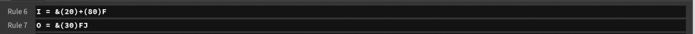
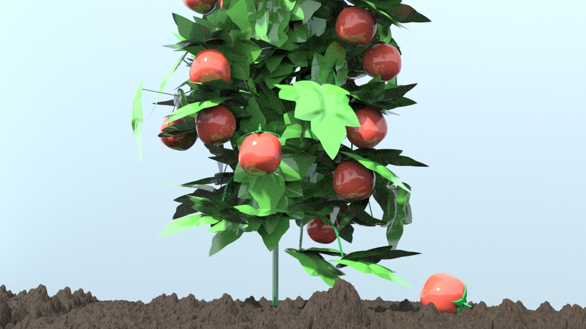

# Homework 4: L-systems

For this homework, I did the option of modelling an L-system plant with Houdini. I really felt like I was able to learn a lot about different aspects of Houdini. I was also able to better understand how to create grammar rules with l-systems, as before I only understood when it came to one rule. When I had done Houdini previously I always followed tutorials to make my entire project, so I'm really happy that with this project, I was able to complete my own unique project using Houdini. 

So the first thing I did was make multiple different l-systems. I used this website https://www.houdinikitchen.net/2019/12/21/how-to-create-l-systems/ to give me ideas on what shapes are possible to create using l-systems. I used some formulas on the website to create l-systems initially so that I could get an idea of what they would look like in the Houdini program. But in the end, I didn't like any of the models I made using the formulas on the website. I also felt like I didn't really understand how any of those formulas worked or how the rules were able to create these shapes. Thus, I began to create my own grammar rules for my l-system plant.

 

I decided to create a tomato plant, mainly because I didn't want to make a tree. I looked up pictures of tomato plant stems and branches on google, and found pretty good inspo (https://www.researchgate.net/publication/272087956/figure/fig6/AS:295050148892691@1447356845919/Visualization-of-a-virtual-cherry-tomato-plant-demonstrated-in-a-two-step-manner-In-a.png). I firstly made the premise really simple (A), because I thought it was too confusing to have a more complicated premise. Then, I focused the main rule to be the one that defined A, and all the other rules builds parts of A. In other words, A represented the entire tomato branching system, while B, C, D, etc. defined different branching patterns that branched off the main stem. The process of tweaking the rules to create an l-system plant that looks the way I envisioned was interesting. It actually opened my eyes to how l-systems worked. What I would do was change the premise to that certain rule (like B, C, D, etc.) so that I can look at that branch individually, tweak it to how I would want it, and then add it to A, the main rule. I ended up making the premise FFA in order to add more height to the plant. After changing the l-system from skeleton to tube, I changed the thickness scale so that the thickness of the tube gets smaller as the generation number increases. I then thought that the main stem was too straight, so I used the (~) operation on A to pitch/roll/turn the main stem a random amount at each generation.

 

Next, after creating the stem, I went onto creating the leaves and tomatoes. To create a leaf, I roughly followed the beginning of a tutorial (https://www.youtube.com/watch?v=oincHvffZtw&ab_channel=SergeyGolubev). I created a line that I bent and manipulated and then copied to another line that acted as the centerline of the leaf. After making this shape into a skin and mirroring it, I had a basic leaf shape. I then bent it slightly downwards to make it look more natural, and that was pretty much it.


  


To create the tomato was more difficult, mostly because I had basically no direction to follow and had to do it completely on my own. First, I created a sphere and then used the mountain node to make the shape a little more irregular. To create the leaves at the top of the tomato I created a line and used the polywire node to make a tube shape. Then, I tapered the tube to stretch out at one end and shrink down to a point at the other end. I then mirrored and duplicated this shape. Lastly, I made a tube as the stem, merged all the elements together, and thus made a tomato.


To add the leaves and tomatoes to the l-system plant, I essentially connected the leaf and tomato shapes to the l-system inputs as J and K respectfully, and then kind of just placed the variables randomly in the grammar rules to see where the leaves/tomatoes would appear. I first marked the positions to place the leaves with spheres.


 For both the tomato and the leaf, I had to change the centerpoint of the shapes so that they would connect to the branches at their endpoints. In some cases, I wanted the leaves to double up, since leaves don't always grow alone. So I would place a J and then place another J but pitched down some degrees and turned some degrees. 
 
 
 
 I placed the tomatoes after placing the leaves. I first used the same technique to place the tomatoes on the plant, but I then saw that when the tomatoes were located in the middle of the branch, although the tomato would be connected to the branch at its stem, it wouldn't always hang downwards and instead be upside down or sideways. But mostly they were upside down. To fix this issue, I made a new rule H that turned every tomato 180 degrees so that they would hang the right way. I then experimented with ways to have the tomatoes only be present at the ends of the branches, since at the ends of the branches the tomato would hang in the direction that the end of the branch is facing, which was usually more downwards. The B branch in particular was very downward facing, so after instances of B in the A rule, I would add the H rule to place a tomato. For the tomatoes that hung off the branches of rule C, they seemed to all tip sideways. Thus, I created a rule I that not only flipped the tomato 180 degrees but also pitched the tomato up 90 degrees so that it would hang downwards.

  

 

Now that I had created my tomato plant model, I then moved onto coloring the plant. I looked up colors online and used 3 different shades of green: the lightest for the leaves, the middle shade for the tomato tops, and the darkest shade for the stem. Lastly, I used a reddish-orangey color for the tomato. I also created a grid with some noise as the ground. 

For the materials, I used Houdini's preset dirt material for the ground. For the plant, there was no leaf texture, and I didn't really know to make one. So, instead I decided to make the plant not very realistic with its material and gave it a shiny, kind of plastic-like look. I like how it reflects light, and I am satisfied with how it turned out, even though I think the reflection makes rendering take kind of forever. For lighting, I just added a sunlight and an environment light. After rendering a few renders, I really did not light the black background, so I added another grid colored light blue to act as a background. I also added a little tomato on the ground to complete the scene.

    


For this assignment, you will design a set of formal grammar rules to create
a plant life using an L-system program. Once again, you will work from a
TypeScript / WebGL 2.0 base code like the one you used in homework 0. You will
implement your own set of classes to handle the L-system grammar expansion and
drawing. You will rasterize your L-system using faceted geometry. Feel free
to use ray marching to generate an interesting background, but trying to
raymarch an entire L-system will take too long to render!

## Base Code
The provided code is very similar to that of homework 1, with the same camera and GUI layout. Additionally, we have provided you with a `Mesh` class that, given a filepath, will construct VBOs describing the vertex positions, normals, colors, uvs, and indices for any `.obj` file. The provided code also uses instanced rendering to draw a single square 10,000 times at different locations and with different colors; refer to the Assignment Requirements section for more details on instanced rendering. Farther down this README, we have also provided some example code snippets for setting up hash map structures in TypeScript.

## Assignment Requirements
- __(15 points)__ Create a collection of classes to represent an L-system. You should have at least the following components to make your L-system functional:
  - A `Turtle` class to represent the current drawing state of your L-System. It should at least keep track of its current position, current orientation, and recursion depth (how many `[` characters have been found while drawing before `]`s)
  - A stack of `Turtle`s to represent your `Turtle` history. Push a copy of your current `Turtle` onto this when you reach a `[` while drawing, and pop the top `Turtle` from the stack and make it your current `Turtle` when you encounter a `]`. Note that in TypeScript, `push()` and `pop()` operations can be done on regular arrays.
  - An expandable string of characters to represent your grammar as you iterate on it.
  - An `ExpansionRule` class to represent the result of mapping a particular character to a new set of characters during the grammar expansion phase of the L-System. By making a class to represent the expansion, you can have a single character expand to multiple possible strings depending on some probability by querying a `Map<string, ExpansionRule>`.
  - A `DrawingRule` class to represent the result of mapping a character to an L-System drawing operation (possibly with multiple outcomes depending on a probability).

- __(10 points)__ Set up the code in `main.ts` and `ShaderProgram.ts` to pass a collection of transformation data to the GPU to draw your L-System geometric components using __instanced rendering__. We will be using instanced rendering to draw our L-Systems because it is much more efficient to pass a single transformation for each object to be drawn rather than an entire collection of vertices. The provided base code has examples of passing a set of `vec3`s to offset the position of each instanced object, and a set of `vec4`s to change the color of each object. You should at least alter the following via instanced rendering (note that these can be accomplished with a single `mat4`):
  - Position
  - Orientation
  - Scaling

- __(55 points)__ Your L-System scene must have the following attributes:
  - Your plant must grow in 3D (branches must not just exist in one plane)
  - Your plant must have flowers, leaves, or some other branch decoration in addition to basic branch geometry
  - Organic variation (i.e. noise or randomness in grammar expansion and/or drawing operations)
  - The background should be a colorful backdrop to complement your plant, incorporating some procedural elements.
  - A flavorful twist. Don't just make a basic variation of the example F[+FX]-FX from the slides! Create a plant that is unique to you. Make an alien tentacle monster plant if you want to! Play around with drawing operations; don't feel compelled to always make your branches straight lines. Curved forms can look quite visually appealing too.

- __(10 points)__ Using dat.GUI, make at least three aspects of your L-System interactive, such as:
  - The probability thresholds in your grammar expansions
  - The angle of rotation in various drawing aspects
  - The size or color or material of the plant components
  - Anything else in your L-System expansion or drawing you'd like to make modifiable; it doesn't have to be these particular elements

- __(10 points)__ Following the specifications listed
[here](https://github.com/pjcozzi/Articles/blob/master/CIS565/GitHubRepo/README.md),
create your own README.md, renaming the file you are presently reading to
INSTRUCTIONS.md. Don't worry about discussing runtime optimization for this
project. Make sure your README contains the following information:
    - Your name and PennKey
    - Citation of any external resources you found helpful when implementing this
    assignment.
    - A link to your live github.io demo (refer to the pinned Piazza post on
      how to make a live demo through github.io)
    - An explanation of the techniques you used to generate your L-System features.
    Please be as detailed as you can; not only will this help you explain your work
    to recruiters, but it helps us understand your project when we grade it!

## Writing classes and functions in TypeScript
Example of a basic Turtle class in TypeScript (Turtle.ts)
```
import {vec3} from 'gl-matrix';

export default class Turtle {
  constructor(pos: vec3, orient: vec3) {
    this.position = pos;
    this.orientation = orient;
  }

  moveForward() {
    add(this.position, this.position, this.orientation * 10.0);
  }
}
```
Example of a hash map in TypeScript:
```
let expansionRules : Map<string, string> = new Map();
expansionRules.set('A', 'AB');
expansionRules.set('B', 'A');

console.log(expansionRules.get('A')); // Will print out 'AB'
console.log(expansionRules.get('C')); // Will print out 'undefined'
```
Using functions as map values in TypeScript:
```
function moveForward() {...}
function rotateLeft() {...}
let drawRules : Map<string, any> = new Map();
drawRules.set('F', moveForward);
drawRules.set('+', rotateLeft);

let func = drawRules.get('F');
if(func) { // Check that the map contains a value for this key
  func();
}
```
Note that in the above case, the code assumes that all functions stored in the `drawRules` map take in no arguments. If you want to store a class's functions as values in a map, you'll have to refer to a specific instance of a class, e.g.
```
let myTurtle: Turtle = new Turtle();
let drawRules: Map<string, any> = new Map();
drawRules.set('F', myTurtle.moveForward.bind(myTurtle));
let func = drawRules.get('F');
if(func) { // Check that the map contains a value for this key
  func();
}
```
TypeScript's `bind` operation sets the `this` variable inside the bound function to refer to the object inside `bind`. This ensures that the `Turtle` in question is the one on which `moveForward` is invoked when `func()` is called with no object.

## Examples from previous years (Click to go to live demo)

Andrea Lin:

[](http://andrea-lin.com/Project3-LSystems/)

Ishan Ranade:

[](https://ishanranade.github.io/homework-4-l-systems-IshanRanade/)

Joe Klinger:

[](https://klingerj.github.io/Project3-LSystems/)

Linshen Xiao:

[](https://githublsx.github.io/homework-4-l-systems-githublsx/)

## Useful Resources
- [The Algorithmic Beauty of Plants](http://algorithmicbotany.org/papers/abop/abop-ch1.pdf)
- [OpenGL Instanced Rendering (Learn OpenGL)](https://learnopengl.com/Advanced-OpenGL/Instancing)
- [OpenGL Instanced Rendering (OpenGL-Tutorial)](http://www.opengl-tutorial.org/intermediate-tutorials/billboards-particles/particles-instancing/)

## Extra Credit (Up to 20 points)
- For bonus points, add functionality to your L-system drawing that ensures geometry will never overlap. In other words, make your plant behave like a real-life plant so that its branches and other components don't compete for the same space. The more complex you make your L-system self-interaction, the more
points you'll earn.
- Any additional visual polish you add to your L-System will count towards extra credit, at your grader's discretion. For example, you could add animation of the leaves or branches in your vertex shader, or add falling leaves or flower petals.
